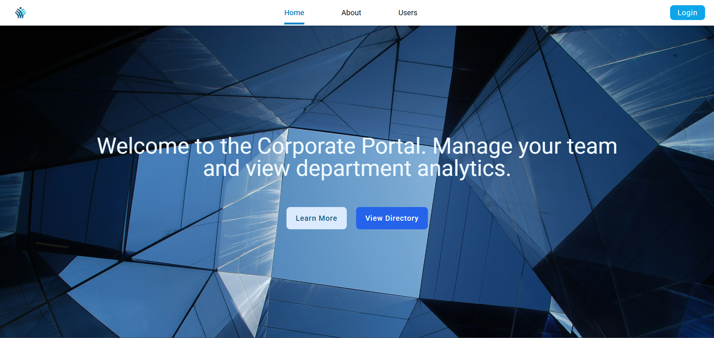

# Product Listing Page

## Table of contents

- [About](#about)
  - [Links](#links)
  - [Screenshots](#screenshots)
  - [Overview](#overview)
  - [Features](#features)
  - [UI/UX Decisions](#uiux-decisions)
  - [Built with](#built-with)
- [Author](#author)
- [Acknowledgments](#acknowledgments)

## About

### Links

Live Site: 

### Screenshots

### Overview

This project is a responsive company directory and management portal built to streamline employee information access. The primary focus was implementing a robust navigation system using the React Router Data Router method to handle complex UI states and dynamic content delivery.

### Features

- **Dynamic Employee Directory**  
  A central hub displaying all team members with details.

- **Deep-Linked Detail Views**  
  Individualized profile pages for every employee using dynamic URL parameters

- **Seamless Navigation**   Integrated "Root" layout that maintains a consistent header across all views.

- **Client-Side Routing**  
  Utilizes React Router for instant page transitions without full-browser refreshes.

### UI/UX Decisions

- Used a layout-route pattern to ensure the header and branding remain fixed while content swaps. This reduces cognitive load for the user as they navigate through different directory levels.

- Prioritized high-level data (names and roles) in the main directory cards, while offloading detailed metadata to individual profile views to prevent information overload on the main list.

- Leveraged URL parameters for user details, ensuring that specific profiles are deep-linkable and shareable within the organization.

### Built With

- HTML
- React
- Tailwind CSS
- JavaScript

## Author

- LinkedIn - [Sruthi V Nair](https://www.linkedin.com/in/sruthi-v-nair-5b5a09191/)
- Github - [Sruthi V Nair](https://github.com/sruthi-nair166)

## Acknowledgments

This project was built as part of an assignment in the Full Stack Development course I'm currently enrolled in, offered by Entri Elevate. Special thanks to the course instructors and materials for the guidance and support.

To build a realistic company directory experience, the following resources were utilized:

- **Mockaroo.com**: Used to generate the custom JSON dataset for the corporate employee database.

- **RandomUser.me**: Provided the diverse profile imagery for the user directory and detail views.
